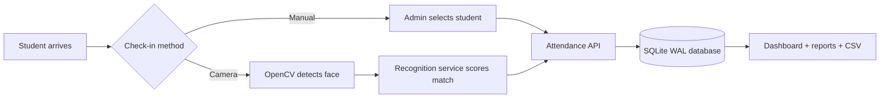

<div align="center">


# Averra

### A calm, intelligent attendance operating system for modern learning teams.

<p>
  <a href="https://github.com/Senaaravichandran/Averra"></a>
  
  
</p>

<p>Presence should be easy to capture, easy to trust, and easy to understand.<br>Averra turns check-ins into a focused daily workspace with recognition, reporting, and deployment-ready foundations.</p>

</div>

## What Averra does

Averra replaces spreadsheet-shaped attendance with one polished workspace for the people running classrooms, cohorts, studios, and internal learning programs.

| Surface | What it gives you |
| --- | --- |
| Overview | Live attendance pulse, recent check-ins, schedule, and actionable insight |
| Attendance | Manual check-in, browser camera permission flow, local OpenCV runner, confidence records |
| Students | Searchable directory, validated roster creation, program and attendance context |
| Schedule | A clear daily planner for sessions and rooms |
| Reports | Date-range consistency view with CSV export |
| Operations | Health/readiness probes, migrations, auth boundary, Docker, Gunicorn, CI |

## Product flow



## Repository structure

The repository is intentionally organized by responsibility. The root is for product operations and documentation; implementation lives inside named domains.

```text
.
├── backend/                    # Python application and camera runtime
│   ├── averra/                 # App factory, API, auth, DB, services
│   │   ├── api.py
│   │   ├── auth.py
│   │   ├── config.py
│   │   ├── db.py
│   │   ├── seed.py
│   │   └── services/recognition.py
│   ├── compat/                 # Legacy import shims for the original prototype
│   ├── app.py                  # Compatibility entrypoint
│   ├── camera.py               # Local webcam runner; press q to quit
│   └── wsgi.py                 # Production WSGI entrypoint
├── frontend/                  # HTML, CSS, browser JavaScript, PWA shell
│   ├── templates/index.html
│   └── static/{css,js,manifest.json,sw.js}
├── database/migrations/        # Ordered SQL migrations
├── data/profiles/              # Local recognition profile photos
├── scripts/run.py              # Canonical local application launcher
├── docs/                       # Deployment, architecture, and README artwork
├── tests/                      # API, auth, migration, and workflow tests
├── archive/                    # Original prototype code and generated exports
├── Dockerfile
├── docker-compose.yml
├── requirements*.txt
└── README.md
```

## Start locally in under two minutes

### Windows PowerShell

```powershell
python -m venv .venv
.\.venv\Scripts\Activate.ps1
python -m pip install --upgrade pip
pip install -r requirements.txt
python scripts/run.py
```

### macOS / Linux

```bash
python3 -m venv .venv
source .venv/bin/activate
python -m pip install --upgrade pip
pip install -r requirements.txt
python scripts/run.py
```

Open **http://127.0.0.1:5050**.

The first development run creates `instance/averra.sqlite3`, applies every migration, and seeds a safe Northstar Institute demo workspace. The database is ignored by Git.

## Camera recognition

The browser camera surface provides the permission and preview experience. The local OpenCV runner provides actual face detection and recognition against profile photos in `data/profiles/`.

```powershell
pip install -r requirements-camera.txt
python -m backend.camera
```

Press `q` to close the camera. A recognized person receives a rectangle, a confidence score, and a once-per-day attendance record.

## Production-shaped deployment

Copy the environment template, fill secrets through your deployment platform, and start the container:

```powershell
Copy-Item .env.example .env
docker compose up --build -d
```

The container listens on **http://localhost:8000** and persists the database in a named volume.

### Credentials when you are ready

Averra never expects credentials in source control. Generate a password hash locally or in your secret manager:

```powershell
python -c "from werkzeug.security import generate_password_hash; print(generate_password_hash('replace-me'))"
```

Set these values in `.env` or your hosting provider’s secret store:

```dotenv
AVERRA_ENV=production
AVERRA_SECRET=<long-random-session-secret>
AVERRA_AUTH_REQUIRED=true
AVERRA_ADMIN_EMAIL=<admin-email>
AVERRA_ADMIN_PASSWORD_HASH=<generated-password-hash>
AVERRA_SEED_DEMO=false
```

Production startup fails fast if the secret is still the development placeholder or if authentication is enabled without both admin values.

Read the complete operational guide in [`docs/DEPLOYMENT.md`](docs/DEPLOYMENT.md).

## API surface

The current browser client uses `/api/*`. Integrations should use the stable `/api/v1/*` alias.

| Method | Endpoint | Purpose |
| --- | --- | --- |
| `GET` | `/api/v1/health` | Process and recognition status |
| `GET` | `/api/v1/ready` | Database readiness |
| `GET/POST/DELETE` | `/api/v1/auth/session` | Auth-ready admin session |
| `GET` | `/api/v1/overview` | Dashboard payload |
| `GET/POST` | `/api/v1/students` | Roster list and creation |
| `GET/POST` | `/api/v1/attendance` | Daily records and check-in |
| `GET` | `/api/v1/reports` | Date-range attendance report |
| `GET` | `/api/v1/reports/export` | CSV download |

## Quality gates

```powershell
pytest
python -m py_compile backend\app.py backend\camera.py backend\wsgi.py backend\averra\api.py backend\averra\db.py scripts\run.py
```

GitHub Actions runs the test suite on Python 3.10, 3.11, and 3.12. Docker uses `requirements-deploy.txt` so the standard Windows development install remains cross-platform.

## Architecture decisions

- **Flask app factory:** clean test isolation and deployment configuration.
- **SQLite + WAL:** reliable single-node persistence without an external service.
- **Versioned SQL migrations:** schema changes are explicit and repeatable.
- **Auth boundary:** credentials can be added through environment variables without rewriting routes.
- **Progressive enhancement:** the dashboard works in manual/demo mode; native recognition is optional.
- **Single-node first:** move the isolated DB layer to PostgreSQL before adding multiple web replicas.

See [`docs/ARCHITECTURE.md`](docs/ARCHITECTURE.md) for the system map and scaling boundary.

## Why the name Averra?

“Averra” sounds steady, clear, and human — the qualities an attendance system should have when it is quietly doing important work in the background.

## Contributing

1. Create a branch from `main`.
2. Keep credentials and generated databases out of commits.
3. Add or update tests with behavior changes.
4. Run the quality gates above before opening a pull request.

## Status

Averra is a production-shaped foundation ready for credential wiring, hosting, and the next institution-specific integrations.
